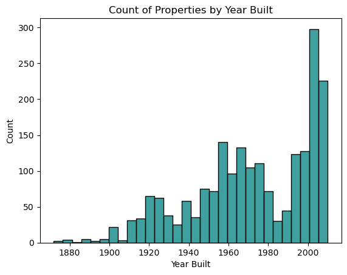
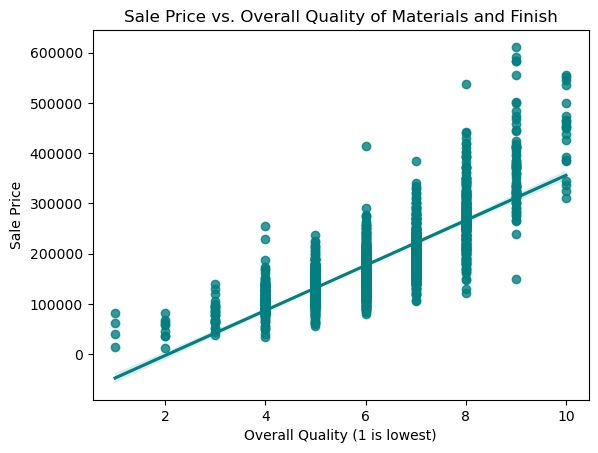
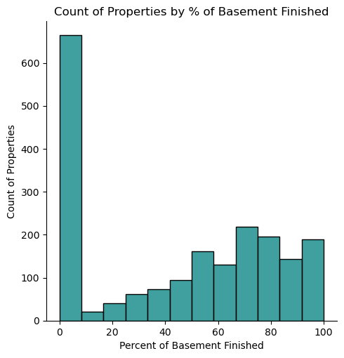

# Associated General Contractors of Iowa Remodeling Campaign Analysis

## Business Case
The Associated General Contractors of Iowa (AGCIA) is an organization of qualified construction contractors and industry related companies dedicated to skill, integrity and responsibility. They are considering funding a marketing campaign to drive increased remodeling business in Ames, Iowa.  AGCIA has asked for an analysis of some historic data the Ames Assessor’s Office used in computing assessed values for individual residential properties sold in Ames, IA from 2006 to 2010. Ideally, they would like some information specific to the Ames market that would support general claims that certain remodeling projects increase home resale prices.  AGCIA would also like to know if certain remodeling projects can be identified in the data so they can target their marketing campaign appropriately.  The main goal is to provide decision support and any details that can be uncovered while performing this analysis.

## Background
For over 95 years AGC of Iowa has been the voice of the Construction Industry. The association offers a full range of services satisfying the needs and concerns of its members, thereby improving the quality of construction and protecting the public interest. ([source](http://www.agcia.org))

There is a perception that there is controversy about whether the cost of remodeling part of your home is a valuable investment or not.  Proponents will often point to factors like improved happiness with your home, making it fit your needs better, and even increasing the value of your home, should you decide to sell it.  Critics argue that remodeling your home won't provide the best return on your investment, can be a complicated and confusing process, and depending on the design choices you make, it may hurt your home value.  They contend that for those reasons you should invest your money in other areas.

Although the AGC marketing department is very creative, they are looking for some additional decision support and information that would help them target their campaign in Ames, Iowa.  They want to use a data-driven approach to approve or deny the funding for this campaign.  In addition, any additional key insights that would help support and strengthen the campaign would be an additional benefit.

According to an article published by Renofi, home improvements with the best ROI are ones that add functional space and square footage, such as finishing a basement. It goes on to also mention that remodeling kitchens/baths and adding curb appeal can also yield high return on investment, but there are various caveats such as what materials and design approach are used. ([source](https://www.renofi.com/learn/renovation-best-return-on-investment/)) 

The National Association of REALTORS® Research Group's [2022 Remodeling Impact Report](./data/2022-remodeling-impact-report.pdf) is fairly comprehensive and has more specific information relating to various home remodeling projects.  They discuss many aspects of both interior and exterior projects, costs, resulting happiness (Joy Score), and costs recovered, among others.  This is national data and not specific to Ames, but does provide some important information.  When looking at which projects they study might have some relationship to the data I am analyzing, I found the following:

- Basement Conversion to Living Area results in a Joy Score of 9.7 and recover about 86% of the value from the project.
- Complete Kitchen Renovation results in a Joy Score of 9.8 and recovers 75% of the value from the project
- Kitchen Upgrade results in a Joy Score of 9.8 and recovers 67% of the value from the project

There is also information about exterior projects, however there wasn't enough data from the Ames Assessor to make any connections to the specific projects they reference.

## Description of Data
### Files:
* [`train.csv`](./data/train.csv): Ames Assessor’s Office data for individual residential properties sold in Ames, IA from 2006 to 2010.
 ([source](http://www.cityofames.org/assessor/))

* [`test.csv`](./data/test.csv): Ames Assessor’s Office data for individual residential properties sold in Ames, IA from 2006 to 2010.
 ([source](http://www.cityofames.org/assessor/))
 
These files contain similar information but have been divided for training and testing different models.

### Data Dictionary

Raw Feature Descriptions can be found [here](http://jse.amstat.org/v19n3/decock/DataDocumentation.txt)

DataFrames:
- `train` Ames Assessor’s Office data for individual residential properties sold in Ames, IA from 2006 to 2010 for model training.
- `test` Ames Assessor’s Office data for individual residential properties sold in Ames, IA from 2006 to 2010 for model testing.

In addition to the original data descriptions from the link above, please note the following details:

|Feature|Type|Description|
|---|---|---|
|**tot_baths**|*float64*|Single feature that combines full and half bathrooms from all house levels|
|**tot_sf**|*float64*|Single feature that combines basement and above grade square footage|
|**bsmt_fin_sf**|*float64*|Finished square feet of basement|
|**bsmt_pct_fin**|*float64*|Percentage of the basement square footage that is finished|

## Analysis Summary
Using the data from the Ames Assessor's office, I cleaned the data and performed exploratory data analysis.  During that process I was able to extract details and insights pertaining to the problem statement for the client.  Once the data was clean, it was used to train various supervised machine learning regression models.  Those models were scored, analyzed and refined in order to try and create a model that explained some amount of sale price variation based on the features, or predictors, used for that model.

The goal, for the models in this project, was not to create the most sophisticated sale price prediction model, but instead focus on the features that were relevant to the topic of remodeling.  This was largely data concerning quality and condition ratings for various aspects of the property spanning from overall quality and condition, to specific areas such as exterior, garage, kitchen, and basement.  Basement had the highest number of features out of all the property areas, which you will see reflected by a more detailed analysis in that area.

After a model was chosen, it was used to intrepret the effect of the various features on the sale price. Due to some of the data transformation and standardization the occurred during this process, the final model was not one that could interpret a specific dollar amount increases per unit for a given feature. However, I am able to use that model to infer the direction and strength of a particular feature in relationship to the sale price, which is how the conclusions and recommendations were derived.  Below, find some of the summaries of the various features, but also some information relating to the business case and the conclusions and next steps for this project.

## House and Lot Summary Information
Looking across the 2000+ records that were provided for analysis, below is some basic summary information.

Mean basic property information:
- 2548 sq ft
- 2.8 bedrooms
- 2.2 bathrooms
- $181,494 sale price

A 'typical' lot in this data appears to be:
- 68 Linear Feet of street connected to the property
- Lot area of ~10,000 square feet
- Accessed by paved roads
- Regular or slightly irregular lot shape
- Level ground
- Inside lot
- All public utilities available

## Market Opportunity
Much of the focus, given the data set and the business case, was around quality and condition, but there are other insights regarding market opportunity to highlight. For the quality and condition information we are focusing on Typical/Average and lower as that is what we are considering target opportunities based on the limited information we have.

### House Age
One of the factors that might drive some remodeling efforts would be the age of the house:
- Although it appears there was a major home construction increase starting in 2000, almost **73% of the houses were built before 2000**.

### General Quality and Condition Information

There appears to be a stronger relationship of overall quality of the material and finish of the house increasing the sale price.  

This appears from our basic charts in most areas that have this information (Overall, Exterior, Basement, Garage, Kitchen).  The amount of impact was examined more closey during modeling.

#### Overall Quality and Condition
Scale: 1 - 10 (very poor to very excellent) 5: Average
- 63% of the houses are characterized as having an overall condition of average or below
- 37% of the houses having materials and finish that rate average or below

#### Exterior, Kitchen, Garage
Scale: Excellent - Good - Average/Typical - Fair - Poor
       
- Exterior
    - 62% of houses have an exterior quality rating of Typical/Average and Below 
    - 89% of houses have an exterior condition of Typical/Average or below
- Kitchen
    - 53% of houses have kitchens with a quality rating of Typical/Average or below
- Garage
    - 98% of houses with garages have a garage quality rating of Typical/Average or below
    - 99% of houses with garages have a garage quality rating of Typical/Average or below

#### Basement Breakdown
- 97% of the houses in the data have a basement
- 96% of the houses that have a basement, basement condition is reported as Typical/Average or lower
- The average of basement in Ames is 45% finished, however when you look more closely, the majority of houses have a very small percentage of their basement finished

- Quality for basement is actually a measurement of height, which may also be helpful in thinking about remodeling opportunities.
- Over 50% of the basements in this data have heights of 90 inches or more
    - These properties had a median selling price over \$300k
- An additional 43% have heights in the 80-89 inch range

### Model Interpretation Summary
A detailed report is available [here](./code/02_Model_Quality_and_Condition.ipynb).

As it relates to providing decision support for our client, the model was used to understand the effects that each feature in the model has on the sale price of a home. Mentioned above, due to the standardizing of the underlying data, the values are no longer in the original scale.  For example, the value for `gr_liv_area` which is 29861.20 should not be thought of as adding $29861 in sale price for each square foot.  Instead, use these to indicate direction and strength of relationship between a feature and the target (sale price).

Relevant insights from the model:
- The features that have the greatest positive effect on sale price are the above-grade living area, overall quality, and garage area.
- Overall quality of materials and finishes are about 5x as impactful on the sale price as the overall condition.
- Quality is significantly more important than condition in all features that had both: Overall, Exterior, and Basement.
- Increasing the amount of finished space in basements has a large positive impact on sale price.
    - More than improving kitchen quality, adding a fireplace or a bathroom.

## Conclusions and Recommendations
Conclusions:
- There appears to be meaningful market opportunity for remodeling in Ames
- When considering elements to focus on for marketing, the data would suggest:
    - Prioritize quality of materials and finishes
    - Remodel with high quality materials
        - With this approach you are taking advantage of both quality and condition
    - Basements and exteriors are the two areas to target for remodeling, followed by Kitchens
    - If you are considering adding square footage to your property:
        - Adding above grade square feet would have the most impact
        - Adding garage square feet is still very positive, but about half the impact as the above grade square footage

Recommendations drawn from these conclusions:
- Based on the analysis performed, I would recommend proceeding with the campaign.
- The data would suggest that there is market opportunity in Ames, as well as data that supports claims about quality and condition factors having positive impacts on sale price.
- Information from other sources like the Remodeling Impact Report, also provide data that would support these conclusions.
- Focusing on basement conversion to living space might be a good approach.
- To make the campaign as successful as possible, I would suggest cross-referencing the information from this report with your local knowledge of the contractors in Ames to focus on any of the specific areas identified that match with their skills.

## Sources
- Associated General Contractors of Iowa - [https://www.agcia.org/](https://www.agcia.org/)

- "2022 Remodeling Impact Report" National Association of REALTORS® Research Group, [2022 Remodeling Impact Report](./data/2022-remodeling-impact-report.pdf) Published April 2022.

- Barrett, Kira. “Which Home Renovations Have the Best Roi (Return on Investment)?” RenoFi, RenoFi, 12 July 2022, [https://www.renofi.com/learn/renovation-best-return-on-investment/](https://www.renofi.com/learn/renovation-best-return-on-investment/). 

- Williams, Terri. “5 Reasons Why You Should Reconsider Renovating Your Home.” Bob Vila, 5 Oct. 2021, [https://www.bobvila.com/articles/reconsider-renovating-home/](https://www.bobvila.com/articles/reconsider-renovating-home/). 

- Martin, Brett. “Is Your Renovation Actually Worth It?” House Beautiful, 11 Jun. 2020, [https://www.housebeautiful.com/home-remodeling/renovation/a21970155/renovation-worth-the-cost/](https://www.housebeautiful.com/home-remodeling/renovation/a21970155/renovation-worth-the-cost/). 